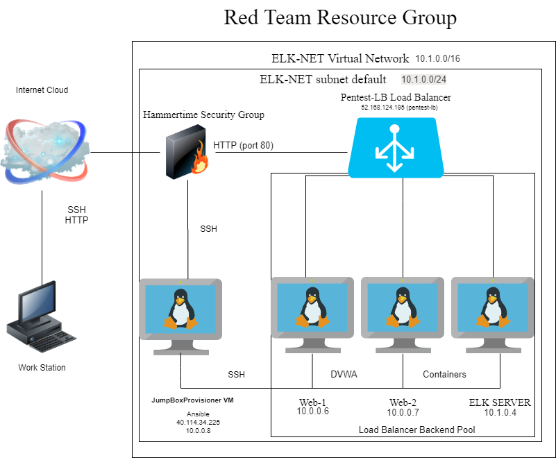
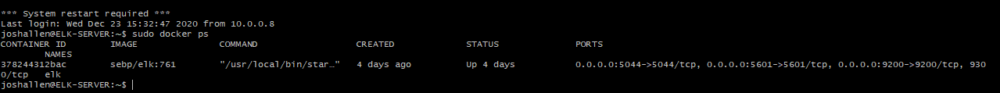

## Automated ELK Stack Deployment

The files in this repository were used to configure the network depicted below.

These files have been tested and used to generate a live ELK deployment on Azure. They can be used to either recreate the entire deployment pictured above. Alternatively, select portions of the playbook file may be used to install only certain pieces of it, such as Filebeat.

  - _TODO: Enter the playbook file: filebeat-install.yml
---
- name: installing and launching filebeat
  hosts: webservers
  become: yes
  tasks:

  - name: download filebeat deb
    command: curl -L -O https://artifacts.elastic.co/downloads/beats/filebeat/filebeat-7.6.1-amd64.deb

  - name: install filebeat deb
    command: sudo dpkg -i filebeat-7.6.1-amd64.deb

  - name: drop in filebeat.yml
    copy:
      src: /etc/ansible/files/filebeat-config.yml
      dest: /etc/filebeat/filebeat.yml

  - name: enable and configure system module
    command: sudo filebeat modules enable system

  - name: setup filebeat
    command: sudo filebeat setup

  - name: start filebeat service
    command: sudo service filebeat start

This document contains the following details:
- Description of the Topologu
- Access Policies
- ELK Configuration
  - Beats in Use
  - Machines Being Monitored
- How to Use the Ansible Build

### Description of the Topology

The main purpose of this network is to expose a load-balanced and monitored instance of DVWA, the D*mn Vulnerable Web Application.

Load balancing ensures that the application will be highly efficient, in addition to restricting access to the network.
- _TODO: What aspect of security do load balancers protect? Load balancers protect against emerging attacks. What is the advantage of a jump box?_A jump box is a secure computer that all admins first connect to before launching any administrative task or use as an origination point to connect to other servers or untrusted environments.

Integrating an ELK server allows users to easily monitor the vulnerable VMs for changes to the log and system traffic.
- _TODO: What does Filebeat watch for?: Filebeat monitors the log files or locations that you specify, collects log events, and forwards them either to Elasticsearch or Logstash for indexing.
- _TODO: What does Metricbeat record?: Metricbeat takes the metrics and statistics that it collects and ships them to the output that you specify, such as Elasticsearch or Logstash.

The configuration details of each machine may be found below.
_Note: Use the [Markdown Table Generator](http://www.tablesgenerator.com/markdown_tables) to add/remove values from the table_.

| Name           | Function  | IP Address | Operating System |
|----------      |---------- |------------|------------------|
| Jump Box       | Gateway   | 10.0.0.8   | Linux            |
| Web-1          | Monitoring| 10.0.0.6   | Linux            |
| Web-2          | Monitoring| 10.0.0.7   | Linux            |
| ELK-SERVER     | Hosting   | 10.1.0.4   | Linux            |

### Access Policies

The machines on the internal network are not exposed to the public Internet. 

Only the Jump Box machine can accept connections from the Internet. Access to this machine is only allowed from the following IP addresses:
- _TODO Add whitelisted IP addresses: 13.77.152.244

Machines within the network can only be accessed by _ELK-SERVER922.
- _TODO: Which machine did you allow to access your ELK VM? What was its IP address?:  JumpBoxProvisioner IP address: 40.114.34.225
A summary of the access policies in place can be found in the table below.

| Name               | Publicly Accessible | Allowed IP Addresses |
|----------          |---------------------|----------------------|
|JumpBoxProvisioner  | Yes                 |      40.114.34.225   |
|                    |                     |                      |
|                    |                     |                      |

### Elk Configuration

Ansible was used to automate configuration of the ELK machine. No configuration was performed manually, which is advantageous because...
- _TODO: What is the main advantage of automating configuration with Ansible?: 

The primary benefit of Ansible is it allows IT administrators to automate away the drudgery from their daily tasks. That frees them to focus on efforts that help deliver more value to the business by spending time on more important tasks.

The playbook implements the following tasks:
- _TODO: In 3-5 bullets, explain the steps of the ELK installation play. E.g., install Docker; download image; etc.:

-Create a new virtual network and then add a peer conenction. 

-Create a new virtual machine to run ELK. Locate and start your ansible container. Place the new virtual machine in the backend pool of an existing Azure load balancing solution. 

-Add the virtual machine to the Ansible Host file. Download and install docker.io, python3-pip and docker.

-Run the ansible container and ensure that it is properly installed. 

-Ensure the  ELK stack server is running by adding the virtual machines ip address and attach it to :5601/app/kibana.

The following screenshot displays the result of running `docker ps` after successfully configuring the ELK instance.

### Target Machines & Beats
This ELK server is configured to monitor the following machines:
- _TODO: List the IP addresses of the machines you are monitoring:

Web-1 10.0.0.6
Web-2 10.0.0.7

We have installed the following Beats on these machines:
- _TODO: Specify which Beats you successfully installed:

Filebeat

Metricbeat

These Beats allow us to collect the following information from each machine:
- _TODO: In 1-2 sentences, explain what kind of data each beat collects, and provide 1 example of what you expect to see. E.g., `Winlogbeat` collects Windows logs, which we use to track user logon events, etc._

### Using the Playbook
In order to use the playbook, you will need to have an Ansible control node already configured. Assuming you have such a control node provisioned: 

SSH into the control node and follow the steps below:
- Copy filebeat.yml from /etc/ansible/files/ to /etc/filebeat/filebeat.yml

- Update the filebeat-config.yml  file to include the ELK server's IP address

- Run the playbook, and navigate to http://13.77.152.244:5601/app/kibana to check that the installation worked as expected.

_TODO: Answer the following questions to fill in the blanks:_
- _Which file is the playbook? Where do you copy it?_  Copy filebeat.yml from /etc/ansible/files/ to /etc/filebeat/filebeat.yml

- _Which file do you update to make Ansible run the playbook on a specific machine? How do I specify which machine to install the ELK server on versus which to install Filebeat on?_  filebeat-config.yml and update the file to include the ELK server's IP address.

- _Which URL do you navigate to in order to check that the ELK server is running? http://13.77.152.244:5601/app/kibana

_As a **Bonus**, provide the specific commands the user will need to run to download the playbook, update the files, etc._
